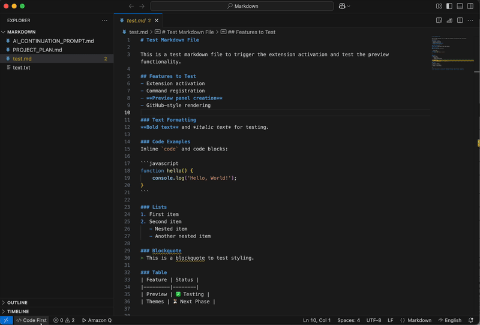

# Markdown Previewer Extension

A VSCode extension that provides enhanced markdown preview functionality with GitHub-style rendering, auto-preview capabilities, and intuitive mode switching.



**Latest Update**: Version 1.1.5 adds keyboard shortcut support (Alt+M / Option+M) for seamless mode switching.

## ✨ Features

### 🚀 **Auto-Preview System**
- **Smart File Opening**: Click any `.md` file in the file browser
  - "Preview First" mode: Opens as rendered preview
  - "Code First" mode: Opens as raw markdown
- **Seamless Mode Switching**: Toggle between preview ↔ code in the same panel

### ✅ **Interactive Elements**
- **Live Checkboxes**: Click checkboxes in preview to update source markdown automatically
- **Save from Preview**: Press Ctrl+S (Cmd+S on Mac) to save directly from preview mode
- **Mermaid.js Diagrams**: Full support for flowcharts, sequence diagrams, and more
- **GIF Support**: Full animated GIF rendering for both local and remote images
- **Position Sync**: Bidirectional scroll synchronization between preview and code editor
- **Smart Mode Switching**: Preview closure automatically switches to code-first mode

### 🎨 **Beautiful Themes**
- **GitHub Light Theme**: Clean, professional styling matching GitHub's markdown rendering
- **Dracula Dark Theme**: Beautiful dark mode with authentic Dracula colors
- **Instant Theme Switching**: Right-click in preview to toggle themes
- **Persistent Preferences**: Theme choice saved across VSCode sessions

### 🎬 **Image & GIF Support**
- **Animated GIFs**: Full support for animated GIF rendering with proper animation
- **Local & Remote**: Support for both local files and remote URLs
- **All Formats**: GIF, PNG, JPG, JPEG, SVG, WebP with responsive sizing
- **Theme Compatible**: Images display in both light and dark themes

### 🖱️ **Intuitive Context Menus**
- **Right-click in Preview**:
  - Toggle Mode (Preview ↔ Code)
  - Toggle Theme (Light/Dark)
- **Right-click in Markdown Editor**:
  - Toggle Mode (Preview ↔ Code)
  - Open Preview

### ⌨️ **Keyboard Shortcuts & Commands**
- **Alt+M / Option+M**: Quick toggle between Preview ↔ Code modes
- **Command Palette** via `Cmd+Shift+P` (Mac) / `Ctrl+Shift+P` (Windows):
  - "Markdown Previewer: Open Preview"
  - "Markdown Previewer: Toggle Mode (Preview ↔ Code)"
  - "Markdown Previewer: Toggle Theme (Light/Dark)"

## 🛠️ Installation & Usage

### Development Mode
1. Clone this repository
2. Open in VSCode
3. Run `npm install` to install dependencies
4. Press `F5` to launch in Extension Development Host
5. Open any `.md` file to see the extension in action!

### Using the Extension
1. **Open a markdown file** - It will automatically open in preview mode (if "Preview First" is set)
2. **Right-click for options**:
   - In preview: Toggle to code view or switch themes
   - In editor: Toggle to preview or open preview panel
3. **Use keyboard shortcuts**: Press **Alt+M** (Windows/Linux) or **Option+M** (Mac) to toggle modes
4. **Use Command Palette**: `Cmd+Shift+P` → "Markdown Previewer" commands

## 📁 Project Structure

```
├── src/
│   ├── extension-standalone.ts  # Complete extension implementation
│   ├── previewManager.ts        # Preview panel management (legacy)
│   ├── themeManager.ts          # Theme handling (legacy)
│   ├── statusBarManager.ts      # Status bar integration (legacy)
│   └── *.test.ts               # Comprehensive test suite
├── dist/
│   └── extension-standalone.js  # Compiled extension bundle
├── package.json                 # Extension manifest & configuration
├── webpack.config.js           # Build configuration
├── tsconfig.json               # TypeScript configuration
└── markdown-previewer-enhanced.vsix  # Final extension package
```

## 🧪 Development Commands

- `npm run compile` - Compile with webpack
- `npm run watch` - Watch mode compilation
- `npm run package` - Production build
- `npm test` - Run test suite
- `npm run lint` - Run ESLint
- `npx vsce package` - Create VSIX extension package

## 🎯 Configuration

The extension provides these settings:

- `markdownPreviewer.defaultMode`: Set default mode ("preview-first" or "code-first")
- `markdownPreviewer.defaultTheme`: Set default theme ("light" or "dark")
- `markdownPreviewer.showModeNotifications`: Show status messages when switching modes

## 🚀 What Makes This Special

- **Zero Configuration**: Works out of the box with sensible defaults
- **GitHub-Style Rendering**: Authentic GitHub markdown styling with Dracula dark theme
- **Interactive Elements**: Live checkboxes and Mermaid.js diagram support
- **Position Sync**: Bidirectional scroll synchronization between preview and editor
- **Smart Workflow**: Automatic mode switching and persistent preferences
- **Intuitive UX**: Right-click context menus make everything discoverable
- **Performance Optimized**: Efficient rendering and memory management
- **Seamless Integration**: Works perfectly with VSCode's existing markdown ecosystem
- **Production Ready**: Thoroughly tested and debugged for reliability

## 🤝 Contributing

The core functionality is complete, but contributions for additional features are welcome:
- PDF export functionality
- Custom CSS themes
- Additional markdown extensions
- Performance improvements

## 📄 License

This project is open source and available under the MIT License.

---

**🎉 Enjoy your beautiful markdown previewing experience!**