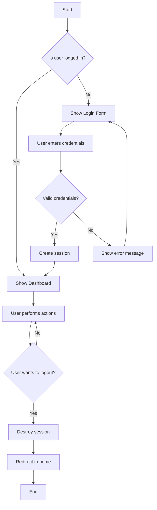
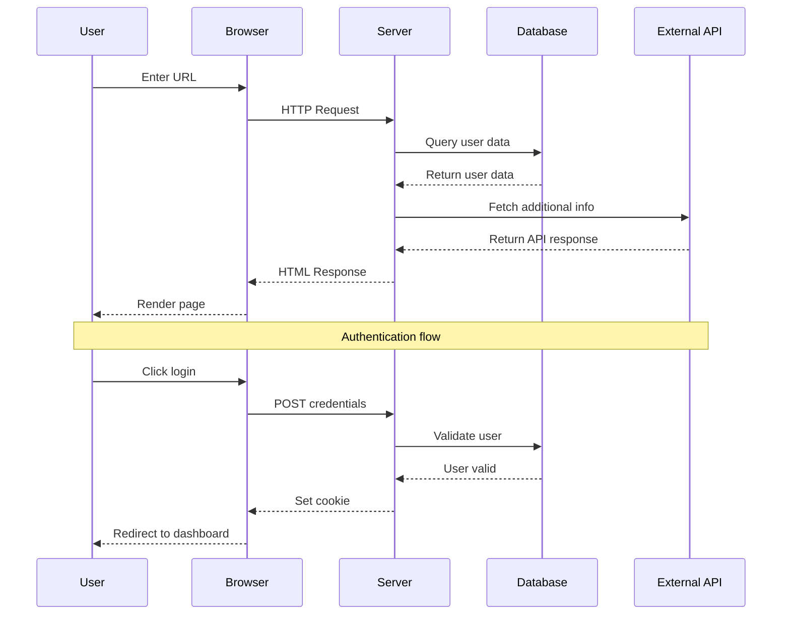
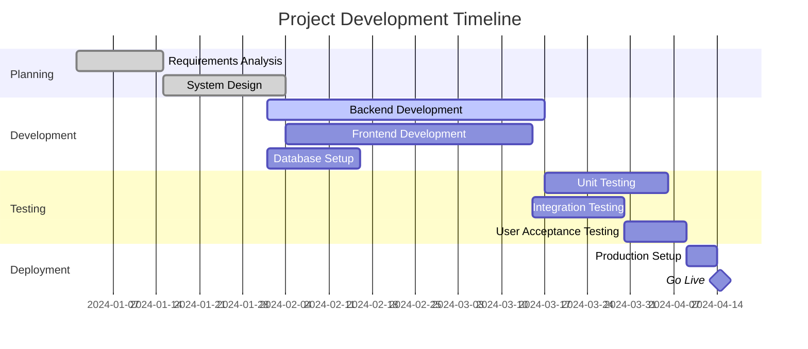
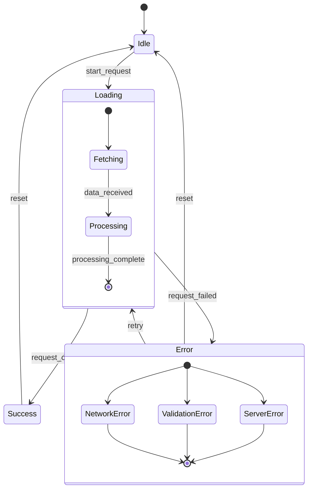

# Complex Markdown Test File

This file tests advanced features of the Markdown Previewer extension.

## Remote Images

### Static Images


### Animated GIFs


## Complex Mermaid Diagrams

### Flowchart with Decision Points


### Sequence Diagram


### Class Diagram
```mermaid
classDiagram
    class User {
        +String name
        +String email
        +Date createdAt
        +login()
        +logout()
        +updateProfile()
    }
    
    class Post {
        +String title
        +String content
        +Date publishedAt
        +User author
        +publish()
        +edit()
        +delete()
    }
    
    class Comment {
        +String content
        +Date createdAt
        +User author
        +Post post
        +reply()
        +edit()
    }
    
    User ||--o{ Post : creates
    User ||--o{ Comment : writes
    Post ||--o{ Comment : has
```

### Gantt Chart


### Git Graph
```mermaid
gitgraph
    commit id: "Initial commit"
    branch develop
    checkout develop
    commit id: "Add user authentication"
    commit id: "Implement dashboard"
    branch feature/posts
    checkout feature/posts
    commit id: "Create post model"
    commit id: "Add post CRUD operations"
    checkout develop
    merge feature/posts
    commit id: "Add post validation"
    checkout main
    merge develop
    commit id: "Release v1.0"
    checkout develop
    commit id: "Add comment system"
    branch hotfix/security
    checkout hotfix/security
    commit id: "Fix security vulnerability"
    checkout main
    merge hotfix/security
    commit id: "Release v1.0.1"
```

### State Diagram


## Interactive Elements

### Checkboxes
- [ ] Test checkbox functionality
- [x] Verify checkbox state updates
- [ ] Check if source markdown updates
- [x] Confirm bidirectional sync
- [ ] Test with nested lists
  - [ ] Nested checkbox 1
  - [x] Nested checkbox 2
  - [ ] Nested checkbox 3

### Code Blocks

#### JavaScript
```javascript
class MarkdownPreviewer {
    constructor(theme = 'light') {
        this.theme = theme;
        this.isPreviewMode = true;
    }
    
    toggleMode() {
        this.isPreviewMode = !this.isPreviewMode;
        this.render();
    }
    
    async loadRemoteImage(url) {
        try {
            const response = await fetch(url);
            return response.ok;
        } catch (error) {
            console.error('Failed to load image:', error);
            return false;
        }
    }
}
```

#### Python
```python
import asyncio
import aiohttp
from typing import Optional

class MermaidRenderer:
    def __init__(self, theme: str = 'default'):
        self.theme = theme
        self.cache = {}
    
    async def render_diagram(self, diagram_code: str) -> Optional[str]:
        """Render mermaid diagram to SVG"""
        if diagram_code in self.cache:
            return self.cache[diagram_code]
        
        async with aiohttp.ClientSession() as session:
            payload = {
                'code': diagram_code,
                'theme': self.theme
            }
            async with session.post('/render', json=payload) as response:
                if response.status == 200:
                    svg_content = await response.text()
                    self.cache[diagram_code] = svg_content
                    return svg_content
        return None
```

## Tables

| Feature | Status | Priority | Notes |
|---------|--------|----------|-------|
| Mermaid Diagrams | ✅ Complete | High | All diagram types supported |
| Remote Images | ✅ Complete | High | PNG, JPG, GIF, SVG |
| Animated GIFs | ✅ Complete | Medium | Full animation support |
| Theme Switching | ✅ Complete | Medium | Light/Dark themes |
| Position Sync | ✅ Complete | Low | Bidirectional scrolling |

## Quotes and Links

> "The best way to test software is to use it in real scenarios with complex data."
> 
> — Software Testing Principles

Check out these resources:
- [Mermaid.js Documentation](https://mermaid-js.github.io/mermaid/)
- [GitHub Flavored Markdown](https://github.github.com/gfm/)
- [VSCode Extension API](https://code.visualstudio.com/api)

---

**Test Instructions:**
1. Toggle between preview and code mode using Alt+M
2. Click checkboxes in preview mode
3. Verify all images and GIFs load properly
4. Check that all Mermaid diagrams render correctly
5. Test theme switching (right-click in preview)
6. Verify position sync when scrolling