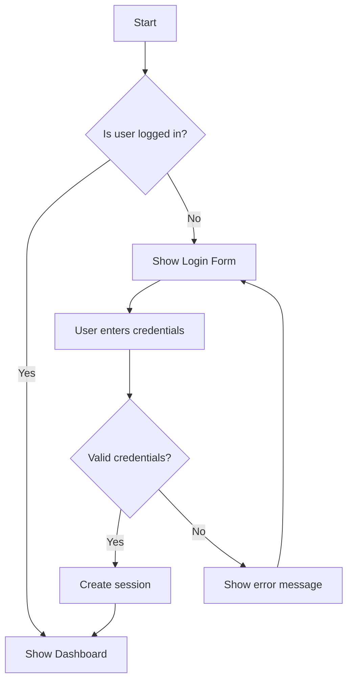
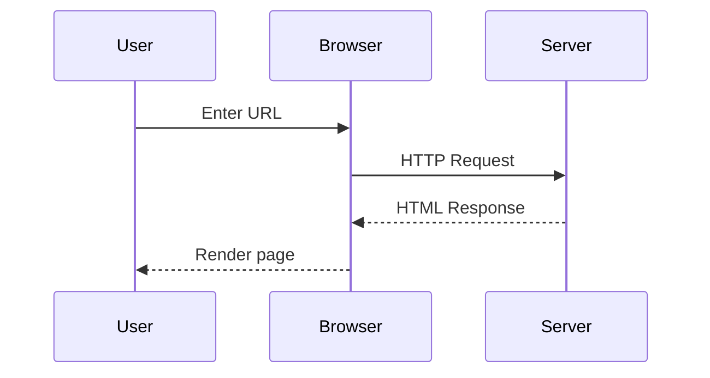
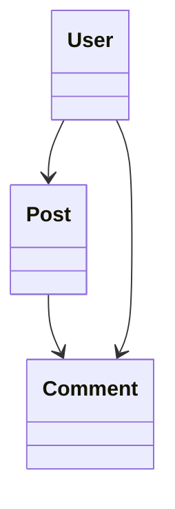
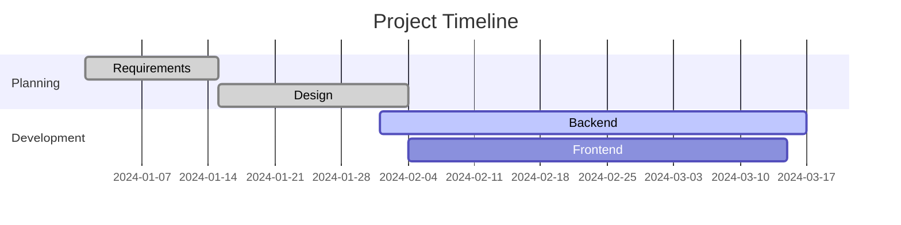

# Fixed Markdown Test File

This file tests the corrected Mermaid diagrams and code highlighting.

## Remote Images & GIFs


## Working Mermaid Diagrams

### Basic Flowchart (graph syntax)


### Sequence Diagram


### Class Diagram


### Gantt Chart


## Code Blocks with Syntax Highlighting

### JavaScript
```javascript
class MarkdownPreviewer {
    constructor(theme = 'light') {
        this.theme = theme;
        this.isPreviewMode = true;
    }
    
    toggleMode() {
        this.isPreviewMode = !this.isPreviewMode;
        this.render();
    }
}
```

### Python
```python
def render_markdown(content):
    """Render markdown to HTML"""
    import markdown
    return markdown.markdown(content)

class MermaidRenderer:
    def __init__(self, theme='default'):
        self.theme = theme
```

### TypeScript
```typescript
interface PreviewConfig {
    theme: 'light' | 'dark';
    mode: 'preview' | 'code';
}

const config: PreviewConfig = {
    theme: 'light',
    mode: 'preview'
};
```

## Interactive Elements
- [ ] Test checkbox functionality
- [x] Verify checkbox updates
- [ ] Check source sync

## Test Instructions
1. All Mermaid diagrams should render properly
2. Code blocks should have syntax highlighting
3. Images and GIFs should load
4. Checkboxes should be interactive