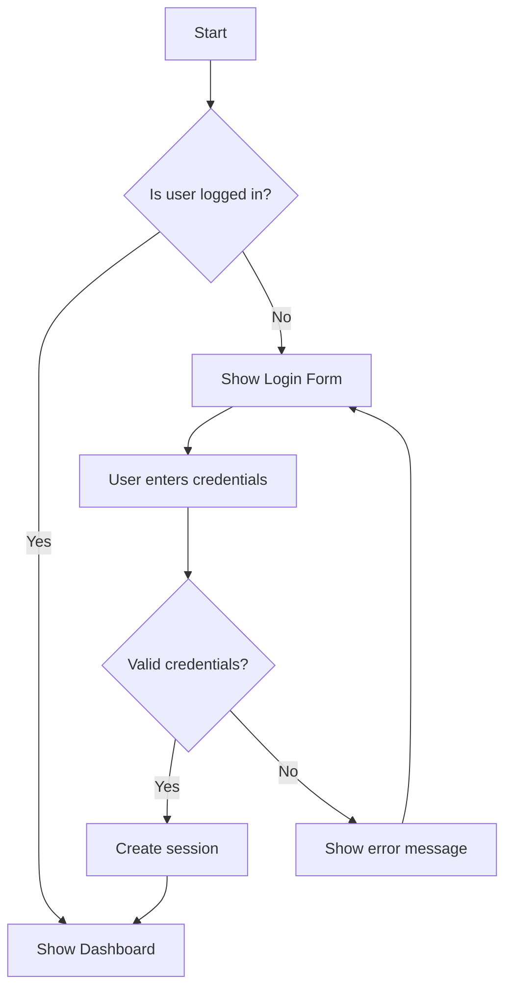
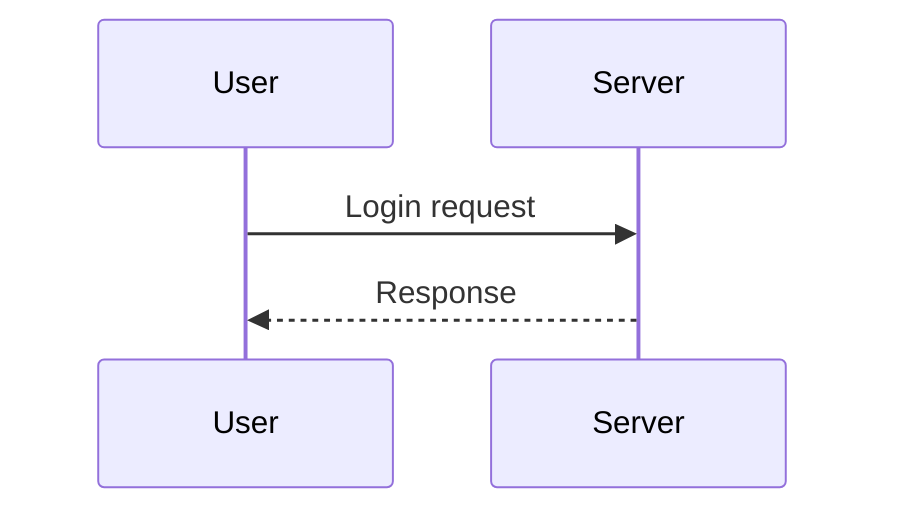
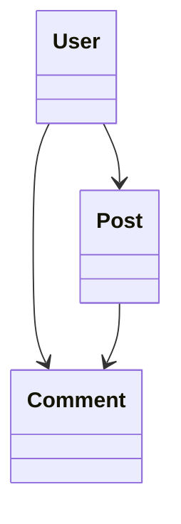

# Mermaid Test

## Working Flowchart (graph syntax)

```mermaid
graph TD
    A[Start] --> B{Is user logged in?}
    B -->|Yes| C[Show Dashboard]
    B -->|No| D[Show Login Form]
    D --> E[User enters credentials]
    E --> F{Valid credentials?}
    F -->|Yes| G[Create session]
    F -->|No| H[Show error message]
    H --> D
    G --> C
```

## Sequence Diagram

```mermaid
sequenceDiagram
    participant U as User
    participant S as Server
    U->>S: Login request
    S-->>U: Response
```

## Class Diagram (Simplified)

```mermaid
classDiagram
    class User
    class Post
    class Comment
    
    User --> Post
    User --> Comment
    Post --> Comment
```

The diagrams above use simplified syntax compatible with mermaid v9.4.3.