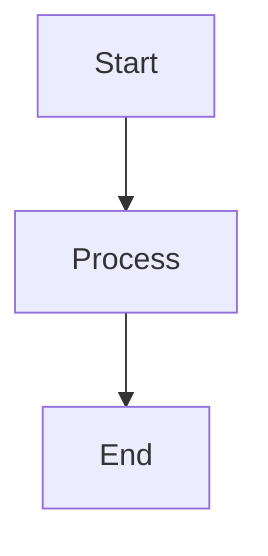

# Test Markdown File

This is a test file for the Markdown Previewer extension.

## Features to Test

- [ ] Interactive checkboxes
- [x] Completed checkbox
- [ ] Another checkbox

### Code Block
```javascript
console.log("Hello, World!");
```

### Mermaid Diagram


**Bold text** and *italic text*

> This is a blockquote

1. Numbered list item 1
2. Numbered list item 2
3. Numbered list item 3